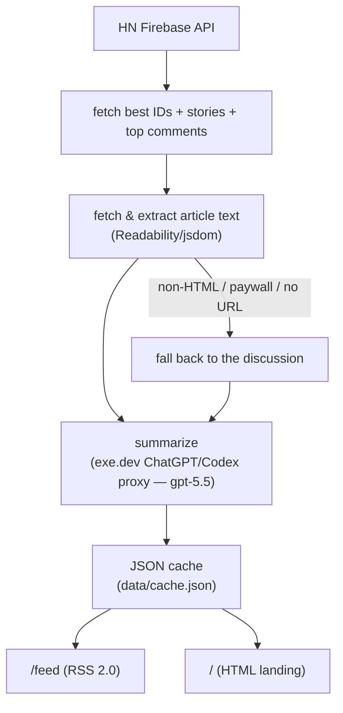

# hn-summaries

An AI-summarized RSS feed of [Hacker News's "best"](https://news.ycombinator.com/best) stories. Every entry is a short summary of the **article *and* the HN discussion**, with links to both — a drop-in upgrade over [`hnrss.org/best`](https://hnrss.org/best) that tells you what a story is about before you click.

**🔗 Live:** **<https://hn.rlew.io/feed>** (paste into your RSS reader) · landing page at **<https://hn.rlew.io/>**

---

## Query parameters

| Param | Default | Notes |
|---|---|---|
| `?count=N` | `30` | How many stories to include (max `200`). |
| `?min_points=N` | `0` | Only include stories with at least N points. |

Examples: [`/feed?count=10`](https://hn.rlew.io/feed?count=10), [`/feed?min_points=300`](https://hn.rlew.io/feed?min_points=300), `/feed?count=15&min_points=200`.

## How it works



A single long-running Bun process refreshes the best list **hourly**, summarizing only stories it hasn't seen before, and serves the feed from an in-memory + on-disk cache. A story that temporarily drops off the best list keeps its summary (pruned only after a retention window), so it isn't re-summarized when it bounces back.

Article text is extracted in tiers: a plain fetch + [Readability](https://github.com/mozilla/readability), then — only on a recoverable failure — a headless-browser render (Chromium via `Bun.WebView`) for JS-heavy pages, and finally a discussion-only fallback. Stories stuck on the fallback are re-extracted on later cycles (a bounded self-healing pass), so a page that was transiently down or needs JS recovers without a manual nudge.

Summaries are generated through the exe.dev internal proxies, which authenticate the VM automatically — **no API key is stored anywhere**. Two backends are selectable via `SUMMARY_PROVIDER`: the [ChatGPT/Codex proxy](https://exe.dev/docs/integrations-github) (`gpt-5.5`, default — draws on the ChatGPT subscription rather than the metered token allowance) or the [LLM gateway](https://exe.dev/docs/shelley/llm-gateway) (`claude-sonnet-4-6`).

### Endpoints

| Path | Description |
|---|---|
| `/feed` | RSS 2.0 feed (`?count`, `?min_points`). Also `/feed.xml`. |
| `/` | HTML landing page: usage + latest 5 stories. |
| `/healthz` | Liveness + cached story count. |
| `/status` | Last refresh time + duration, next-refresh ETA, cache size, last error, and a fallback breakdown (count/percent + tally by reason). |

## Running locally

Requires [Bun](https://bun.sh) ≥1.3.12 (pinned to 1.3.14 — `Bun.WebView` powers the browser extraction tier). Bun runs the TypeScript directly: no build step, no bundler, no `tsx`. Summarization needs to run on an exe.dev VM (for the keyless proxies) — or point the endpoints at your own OpenAI/Anthropic-compatible services. The browser tier additionally needs a Chrome/Chromium binary (set `BUN_CHROME_PATH` or put it on `$PATH`); disable it with `BROWSER_FALLBACK_ENABLED=false`.

```bash
bun install
bun start            # bun index.ts — serves on :8000, runs the first refresh on boot
bun run typecheck    # tsc --noEmit
```

The first boot summarizes the full best list (~200 stories, a few minutes); `/feed` returns `503` until the cache has entries. The cache persists to `data/cache.json` (gitignored), so restarts are instant.

### Configuration

Environment variables:

| Var | Default | Purpose |
|---|---|---|
| `PORT` | `8000` | Listen port. |
| `PUBLIC_URL` | `https://hn.rlew.io` | Canonical origin used in the feed's self-link and the landing page. |
| `SUMMARY_PROVIDER` | `openai-responses` | Backend: `openai-responses` (ChatGPT/Codex proxy) or `anthropic` (LLM gateway). |
| `OPENAI_ENDPOINT` / `OPENAI_MODEL` | ChatGPT proxy · `gpt-5.5` | Used when provider is `openai-responses`. |
| `LLM_ENDPOINT` / `LLM_MODEL` | LLM gateway · `claude-sonnet-4-6` | Used when provider is `anthropic`. |

Everything else — refresh interval, concurrency, article-size caps, per-refresh cost cap, off-list retention, comment count — lives in [`src/config.ts`](src/config.ts).

## Project layout

```
index.ts             entrypoint: start server, refresh on boot, schedule hourly
src/config.ts        all checked-in tunables
src/options.ts       local (gitignored) per-deployment options, e.g. <head> injection
src/hn.ts            Hacker News Firebase API client
src/extract.ts       article fetch (content-type/size guards) + Readability; HTML→text
src/extract-browser.ts  headless-browser (Bun.WebView) extraction fallback tier
src/summarize.ts     summarization backends (ChatGPT proxy + LLM gateway), prompts, retry
src/cache.ts         JSON cache (in-memory singleton, atomic write, prune)
src/refresh.ts       refresh pipeline (bounded concurrency, fallback-retry pass)
src/feed.ts          RSS 2.0 rendering
src/page.ts          HTML landing page
src/html.ts          shared rendering helpers (escaping, domain, stats)
src/server.ts        node:http server + static favicon assets
public/              favicons (orange "AI" mark)
hn-summaries.service systemd unit
```

## Deployment

Runs as a `systemd` service (`hn-summaries.service`) on an exe.dev VM, listening on `:8000`, published through the exe.dev HTTPS proxy with a `CNAME` for `hn.rlew.io` (TLS auto-issued). The hourly refresh runs in-process — no external cron.

```bash
sudo cp hn-summaries.service /etc/systemd/system/
sudo systemctl enable --now hn-summaries
journalctl -u hn-summaries -f
```

---

Story content © its respective authors; summaries are AI-generated and may contain errors.
